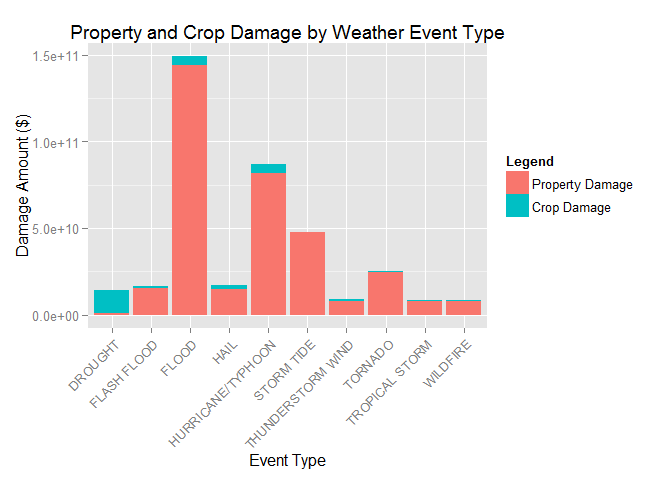

# Health and Economic Impacts of Weather Events in the United States
Theodore Lano  
January 31, 2016  

Synopsis
-------------------------------------------------------
Using data from the U.S. National Oceanic and Atmospheric Administration's (NOAA) storm database, we seek to evaluate the health and economic impacts of weather events.  Health impacts are evaluated based on the number of fatalities and injuries that occur, and economic impacts are a measure of property and crop damages as a result of weather events.

Our approach is to clean the data by removing non-applicable data, re-classifying mislabeled data, and then summing up all fatalities, injuries, property damage, and crop damage by weather event types.  Non-applicable data includes data which was recorded before all event types were being monitored (incomplete sampling) and data which did not register any health or economic impact.  Many of the event types found in the raw data set were not official types as defined by [National Weather Service Storm Data Documentation](https://d396qusza40orc.cloudfront.net/repdata%2Fpeer2_doc%2Fpd01016005curr.pdf), so a manual mapping strategy had to be implemented in order to include these data entries.

Data Processing
------------------------------------------------------
The [Storm Data](https://d396qusza40orc.cloudfront.net/repdata%2Fdata%2FStormData.csv.bz2) is downloaded and loaded into our program.  The code below will go into more detail on how we've went about our data processing.

**Load libraries and download dataset**  

```r
library(plyr)
library(dplyr)
```

```
## 
## Attaching package: 'dplyr'
```

```
## The following objects are masked from 'package:plyr':
## 
##     arrange, count, desc, failwith, id, mutate, rename, summarise,
##     summarize
```

```
## The following objects are masked from 'package:stats':
## 
##     filter, lag
```

```
## The following objects are masked from 'package:base':
## 
##     intersect, setdiff, setequal, union
```

```r
library(reshape2)
library(ggplot2)
```

```
## Warning: package 'ggplot2' was built under R version 3.2.2
```

```r
file_dl <- './StormData.csv.bz2'
if (!file.exists(file_dl))
{
  file_dl <- download.file("https://d396qusza40orc.cloudfront.net/repdata%2Fdata%2FStormData.csv.bz2", "StormData.csv.bz2")
}
```

**Define columns to retrieve from dataset**  
The dataset is very large, so we will define which columns we wish to retrieve  
These include: STATE, BGN_DATE, STATE, EVTYPE, FATALITIES, INJURIES, PROPDMG, PROPDMGEXP, CROPDMG, CROPDMGEXP

```r
fac <- "factor"
nul <- "NULL"
num <- "numeric"
col_classes <- c(nul, fac, rep(nul, 4), fac, fac, rep(nul, 14), rep(num, 3), fac, num, fac, rep(nul, 9))
data <- read.csv("StormData.csv.bz2", header=T, sep=",", strip.white=TRUE, colClasses= col_classes)
```

**Output data dimensions for reference**  

```r
dim(data) # 902297
```

```
## [1] 902297      9
```

**Filter out dates before 1996**  
Not all EVTYPEs were monitored before 1996.  In order to make a fair comparison, we will only look at time periods including all weather classifications.  
First we convert BGN_DATE to a Date type so that we can filter appropriately  

```r
data$BGN_DATE <- as.Date(data$BGN_DATE, format = "%m/%d/%Y")
data.dateSub <- filter(data, BGN_DATE > as.Date("12/31/1995", format = "%m/%d/%Y"))
```

**Output data dimensions for reference**  

```r
dim(data.dateSub) # 653530
```

```
## [1] 653530      9
```

**Filter out non-damaging storm data**  
For the purposes of our analysis, we are not concerned with data that does not have an impact on public health or economics.  Therefore, we filter out data without fatalities, injuries, property damange, or crop damage.  

```r
data.dmg <- filter(data.dateSub, FATALITIES > 0 | INJURIES > 0 | PROPDMG > 0 | CROPDMG > 0)
```

**Output data dimensions for reference**  

```r
dim(data.dmg) # 201318
```

```
## [1] 201318      9
```

**Find EVTYPE labels**  
Take a look at all unique EVTYPE labels to see how we want to map them into official labels  

```r
data.dmg$EVTYPE <- toupper(data.dmg$EVTYPE)
unique(data.dmg$EVTYPE)
```

```
##   [1] "WINTER STORM"              "TORNADO"                  
##   [3] "TSTM WIND"                 "HIGH WIND"                
##   [5] "FLASH FLOOD"               "FREEZING RAIN"            
##   [7] "EXTREME COLD"              "LIGHTNING"                
##   [9] "HAIL"                      "FLOOD"                    
##  [11] "TSTM WIND/HAIL"            "EXCESSIVE HEAT"           
##  [13] "RIP CURRENTS"              "OTHER"                    
##  [15] "HEAVY SNOW"                "WILD/FOREST FIRE"         
##  [17] "ICE STORM"                 "BLIZZARD"                 
##  [19] "STORM SURGE"               "ICE JAM FLOOD (MINOR"     
##  [21] "DUST STORM"                "STRONG WIND"              
##  [23] "DUST DEVIL"                "URBAN/SML STREAM FLD"     
##  [25] "FOG"                       "ROUGH SURF"               
##  [27] "HEAVY SURF"                "HEAVY RAIN"               
##  [29] "MARINE ACCIDENT"           "AVALANCHE"                
##  [31] "FREEZE"                    "DRY MICROBURST"           
##  [33] "WINDS"                     "COASTAL STORM"            
##  [35] "EROSION/CSTL FLOOD"        "RIVER FLOODING"           
##  [37] "WATERSPOUT"                "DAMAGING FREEZE"          
##  [39] "HURRICANE"                 "TROPICAL STORM"           
##  [41] "BEACH EROSION"             "HIGH SURF"                
##  [43] "HEAVY RAIN/HIGH SURF"      "UNSEASONABLE COLD"        
##  [45] "EARLY FROST"               "WINTRY MIX"               
##  [47] "DROUGHT"                   "COASTAL FLOODING"         
##  [49] "TORRENTIAL RAINFALL"       "LANDSLUMP"                
##  [51] "HURRICANE EDOUARD"         "TIDAL FLOODING"           
##  [53] "STRONG WINDS"              "EXTREME WINDCHILL"        
##  [55] "GLAZE"                     "EXTENDED COLD"            
##  [57] "WHIRLWIND"                 "HEAVY SNOW SHOWER"        
##  [59] "LIGHT SNOW"                "COASTAL FLOOD"            
##  [61] "MIXED PRECIP"              "COLD"                     
##  [63] "FREEZING SPRAY"            "DOWNBURST"                
##  [65] "MUDSLIDES"                 "MICROBURST"               
##  [67] "MUDSLIDE"                  "SNOW"                     
##  [69] "SNOW SQUALLS"              "WIND DAMAGE"              
##  [71] "LIGHT SNOWFALL"            "FREEZING DRIZZLE"         
##  [73] "GUSTY WIND/RAIN"           "GUSTY WIND/HVY RAIN"      
##  [75] "WIND"                      "COLD TEMPERATURE"         
##  [77] "HEAT WAVE"                 "COLD AND SNOW"            
##  [79] "RAIN/SNOW"                 "TSTM WIND (G45)"          
##  [81] "GUSTY WINDS"               "GUSTY WIND"               
##  [83] "TSTM WIND 40"              "TSTM WIND 45"             
##  [85] "HARD FREEZE"               "TSTM WIND (41)"           
##  [87] "HEAT"                      "RIVER FLOOD"              
##  [89] "TSTM WIND (G40)"           "RIP CURRENT"              
##  [91] "MUD SLIDE"                 "FROST/FREEZE"             
##  [93] "SNOW AND ICE"              "AGRICULTURAL FREEZE"      
##  [95] "WINTER WEATHER"            "SNOW SQUALL"              
##  [97] "ICY ROADS"                 "THUNDERSTORM"             
##  [99] "HYPOTHERMIA/EXPOSURE"      "LAKE EFFECT SNOW"         
## [101] "MIXED PRECIPITATION"       "BLACK ICE"                
## [103] "COASTALSTORM"              "DAM BREAK"                
## [105] "BLOWING SNOW"              "FROST"                    
## [107] "GRADIENT WIND"             "UNSEASONABLY COLD"        
## [109] "TSTM WIND AND LIGHTNING"   "WET MICROBURST"           
## [111] "HEAVY SURF AND WIND"       "FUNNEL CLOUD"             
## [113] "TYPHOON"                   "LANDSLIDES"               
## [115] "HIGH SWELLS"               "HIGH WINDS"               
## [117] "SMALL HAIL"                "UNSEASONAL RAIN"          
## [119] "COASTAL FLOODING/EROSION"  " TSTM WIND (G45)"         
## [121] "TSTM WIND  (G45)"          "HIGH WIND (G40)"          
## [123] "TSTM WIND (G35)"           "COASTAL EROSION"          
## [125] "UNSEASONABLY WARM"         "SEICHE"                   
## [127] "COASTAL  FLOODING/EROSION" "HYPERTHERMIA/EXPOSURE"    
## [129] "ROCK SLIDE"                "GUSTY WIND/HAIL"          
## [131] "HEAVY SEAS"                " TSTM WIND"               
## [133] "LANDSPOUT"                 "RECORD HEAT"              
## [135] "EXCESSIVE SNOW"            "FLOOD/FLASH/FLOOD"        
## [137] "WIND AND WAVE"             "FLASH FLOOD/FLOOD"        
## [139] "LIGHT FREEZING RAIN"       "ICE ROADS"                
## [141] "HIGH SEAS"                 "RAIN"                     
## [143] "ROUGH SEAS"                "TSTM WIND G45"            
## [145] "NON-SEVERE WIND DAMAGE"    "WARM WEATHER"             
## [147] "THUNDERSTORM WIND (G40)"   "LANDSLIDE"                
## [149] "HIGH WATER"                " FLASH FLOOD"             
## [151] "LATE SEASON SNOW"          "WINTER WEATHER MIX"       
## [153] "ROGUE WAVE"                "FALLING SNOW/ICE"         
## [155] "NON-TSTM WIND"             "NON TSTM WIND"            
## [157] "BRUSH FIRE"                "BLOWING DUST"             
## [159] "VOLCANIC ASH"              "   HIGH SURF ADVISORY"    
## [161] "HAZARDOUS SURF"            "WILDFIRE"                 
## [163] "COLD WEATHER"              "ICE ON ROAD"              
## [165] "DROWNING"                  "EXTREME COLD/WIND CHILL"  
## [167] "MARINE TSTM WIND"          "HURRICANE/TYPHOON"        
## [169] "DENSE FOG"                 "WINTER WEATHER/MIX"       
## [171] "ASTRONOMICAL HIGH TIDE"    "HEAVY SURF/HIGH SURF"     
## [173] "TROPICAL DEPRESSION"       "LAKE-EFFECT SNOW"         
## [175] "MARINE HIGH WIND"          "THUNDERSTORM WIND"        
## [177] "TSUNAMI"                   "STORM SURGE/TIDE"         
## [179] "COLD/WIND CHILL"           "LAKESHORE FLOOD"          
## [181] "MARINE THUNDERSTORM WIND"  "MARINE STRONG WIND"       
## [183] "ASTRONOMICAL LOW TIDE"     "DENSE SMOKE"              
## [185] "MARINE HAIL"               "FREEZING FOG"
```

**Create a clean dataset by transforming unofficial EVTYPE values into official ones**
Documentation for [Official Event Types](http://www.nws.noaa.gov/directives/sym/pd01016005curr.pdf)  
Creating the mapping for these Event Types introduces variability into this analysis because not everybody will classify the unofficial types in the same way.  Having a meteorologist determine the mapping would certainly make the data more official and reliable.  
The ordering of these commands below is important due to the nature of find and replace strategies.

```r
data.dmg_clean <- data.dmg
data.dmg_clean$EVTYPE[grepl("LAKE EFFECT SNOW", data.dmg_clean$EVTYPE)] <- "LAKE-EFFECT SNOW"
data.dmg_clean$EVTYPE[grepl("RIP CURRENT", data.dmg_clean$EVTYPE)] <- "RIP CURRENT"
data.dmg_clean$EVTYPE[grepl("LANDSPOUT", data.dmg_clean$EVTYPE)] <- "TORNADO"
data.dmg_clean$EVTYPE[grepl("WHIRLWIND", data.dmg_clean$EVTYPE)] <- "TORNADO"
data.dmg_clean$EVTYPE[grepl("BLOWING DUST", data.dmg_clean$EVTYPE)] <- "DUST STORM"
data.dmg_clean$EVTYPE[grepl("^FOG$", data.dmg_clean$EVTYPE)] <- "DENSE FOG"
data.dmg_clean$EVTYPE[grepl("FIRE", data.dmg_clean$EVTYPE)] <- "WILDFIRE"
data.dmg_clean$EVTYPE[grepl("LANDSLUMP", data.dmg_clean$EVTYPE)] <- "DEBRIS FLOW"
data.dmg_clean$EVTYPE[grepl("SQUALL", data.dmg_clean$EVTYPE)] <- "BLIZZARD"
data.dmg_clean$EVTYPE[grepl("BLOWING SNOW", data.dmg_clean$EVTYPE)] <- "BLIZZARD"
data.dmg_clean$EVTYPE[grepl("(HEAVY|EXCESSIVE) SNOW", data.dmg_clean$EVTYPE)] <- "HEAVY SNOW"
data.dmg_clean$EVTYPE[grepl("C(OA)?ST(A)?L( )+FLOOD", data.dmg_clean$EVTYPE)] <- "COASTAL FLOOD"
data.dmg_clean$EVTYPE[grepl("TIDAL FLOOD", data.dmg_clean$EVTYPE)] <- "COASTAL FLOOD"
data.dmg_clean$EVTYPE[grepl("FLASH", data.dmg_clean$EVTYPE)] <- "FLASH FLOOD"
data.dmg_clean$EVTYPE[grepl("RIVER FLOOD", data.dmg_clean$EVTYPE)] <- "FLOOD"
data.dmg_clean$EVTYPE[grepl("FLD", data.dmg_clean$EVTYPE)] <- "FLOOD"
data.dmg_clean$EVTYPE[grepl("(SLIDE|EROSION)", data.dmg_clean$EVTYPE)] <- "DEBRIS FLOW"
data.dmg_clean$EVTYPE[grepl("SURF", data.dmg_clean$EVTYPE)] <- "HIGH SURF"
data.dmg_clean$EVTYPE[grepl("HIGH WATER", data.dmg_clean$EVTYPE)] <- "HIGH SURF"
data.dmg_clean$EVTYPE[grepl("HIGH TIDE", data.dmg_clean$EVTYPE)] <- "HIGH SURF"
data.dmg_clean$EVTYPE[grepl("HIGH SWELLS", data.dmg_clean$EVTYPE)] <- "HIGH SURF"
data.dmg_clean$EVTYPE[grepl("STORM SURGE", data.dmg_clean$EVTYPE)] <- "STORM TIDE"
data.dmg_clean$EVTYPE[grepl("HEAVY SEAS", data.dmg_clean$EVTYPE)] <- "STORM TIDE"
data.dmg_clean$EVTYPE[grepl("ROUGH SEAS", data.dmg_clean$EVTYPE)] <- "STORM TIDE"
data.dmg_clean$EVTYPE[grepl("HIGH SEAS", data.dmg_clean$EVTYPE)] <- "STORM TIDE"
data.dmg_clean$EVTYPE[grepl("COASTAL( )?STORM", data.dmg_clean$EVTYPE)] <- "STORM TIDE"
data.dmg_clean$EVTYPE[grepl("HURRICANE", data.dmg_clean$EVTYPE)] <- "HURRICANE/TYPHOON"
data.dmg_clean$EVTYPE[grepl("TYPHOON", data.dmg_clean$EVTYPE)] <- "HURRICANE/TYPHOON"
data.dmg_clean$EVTYPE[grepl("EXTREME (COLD|WINDCHILL)", data.dmg_clean$EVTYPE)] <- "EXTREME COLD/WIND CHILL"
data.dmg_clean$EVTYPE[grepl("^COLD WEATHER$", data.dmg_clean$EVTYPE)] <- "COLD/WIND CHILL"
data.dmg_clean$EVTYPE[grepl("^UNSEASONABL(E|Y) COLD$", data.dmg_clean$EVTYPE)] <- "COLD/WIND CHILL"
data.dmg_clean$EVTYPE[grepl("EXTENDED COLD", data.dmg_clean$EVTYPE)] <- "COLD/WIND CHILL"
data.dmg_clean$EVTYPE[grepl("EXPOSURE", data.dmg_clean$EVTYPE)] <- "COLD/WIND CHILL"
data.dmg_clean$EVTYPE[grepl("^COLD", data.dmg_clean$EVTYPE)] <- "COLD/WIND CHILL"
data.dmg_clean$EVTYPE[grepl("SMALL HAIL", data.dmg_clean$EVTYPE)] <- "HAIL"
data.dmg_clean$EVTYPE[grepl("NON[- ]?TSTM WIND", data.dmg_clean$EVTYPE)] <- "STRONG WIND"
data.dmg_clean$EVTYPE[grepl("MARINE TSTM WIND", data.dmg_clean$EVTYPE)] <- "MARINE THUNDERSTORM WIND"
data.dmg_clean$EVTYPE[grepl("^THUNDERSTORM$", data.dmg_clean$EVTYPE)] <- "THUNDERSTORM WIND"
data.dmg_clean$EVTYPE[grepl("TSTM WIND", data.dmg_clean$EVTYPE)] <- "THUNDERSTORM WIND"
data.dmg_clean$EVTYPE[grepl("^THUNDERSTORM WIND", data.dmg_clean$EVTYPE)] <- "THUNDERSTORM WIND"
data.dmg_clean$EVTYPE[grepl("^STRONG WIND", data.dmg_clean$EVTYPE)] <- "STRONG WIND"
data.dmg_clean$EVTYPE[grepl("GUSTY", data.dmg_clean$EVTYPE)] <- "STRONG WIND"
data.dmg_clean$EVTYPE[grepl("^HIGH WIND", data.dmg_clean$EVTYPE)] <- "STRONG WIND"
data.dmg_clean$EVTYPE[grepl("GRADIENT WIND", data.dmg_clean$EVTYPE)] <- "STRONG WIND"
data.dmg_clean$EVTYPE[grepl("DOWNBURST", data.dmg_clean$EVTYPE)] <- "STRONG WIND"
data.dmg_clean$EVTYPE[grepl("MICROBURST", data.dmg_clean$EVTYPE)] <- "STRONG WIND"
data.dmg_clean$EVTYPE[grepl("NON-SEVERE WIND DAMAGE", data.dmg_clean$EVTYPE)] <- "STRONG WIND"
data.dmg_clean$EVTYPE[grepl("^WIND", data.dmg_clean$EVTYPE)] <- "STRONG WIND"
data.dmg_clean$EVTYPE[grepl("(EXCESSIVE|RECORD) HEAT", data.dmg_clean$EVTYPE)] <- "EXCESSIVE HEAT"
data.dmg_clean$EVTYPE[grepl("HEAT WAVE", data.dmg_clean$EVTYPE)] <- "EXCESSIVE HEAT"
data.dmg_clean$EVTYPE[grepl("WARM", data.dmg_clean$EVTYPE)] <- "HEAT"
data.dmg_clean$EVTYPE[grepl("MIXED PRECIP", data.dmg_clean$EVTYPE)] <- "SLEET"
data.dmg_clean$EVTYPE[grepl("FREEZING RAIN", data.dmg_clean$EVTYPE)] <- "SLEET"
data.dmg_clean$EVTYPE[grepl("RAIN/SNOW", data.dmg_clean$EVTYPE)] <- "SLEET"
data.dmg_clean$EVTYPE[grepl("FREEZING DRIZZLE", data.dmg_clean$EVTYPE)] <- "SLEET"
data.dmg_clean$EVTYPE[grepl("GLAZE", data.dmg_clean$EVTYPE)] <- "FREEZING FOG"
data.dmg_clean$EVTYPE[grepl("FROST", data.dmg_clean$EVTYPE)] <- "FROST/FREEZE"
data.dmg_clean$EVTYPE[grepl("FREEZE$", data.dmg_clean$EVTYPE)] <- "FROST/FREEZE"
data.dmg_clean$EVTYPE[grepl("WINTER WEATHER", data.dmg_clean$EVTYPE)] <- "WINTER WEATHER"
data.dmg_clean$EVTYPE[grepl("WINTRY MIX", data.dmg_clean$EVTYPE)] <- "WINTER STORM"
data.dmg_clean$EVTYPE[grepl("LIGHT SNOW", data.dmg_clean$EVTYPE)] <- "WINTER WEATHER"
data.dmg_clean$EVTYPE[grepl("LATE SEASON SNOW", data.dmg_clean$EVTYPE)] <- "WINTER WEATHER"
data.dmg_clean$EVTYPE[grepl("^SNOW$", data.dmg_clean$EVTYPE)] <- "WINTER WEATHER"
data.dmg_clean$EVTYPE[grepl("TORRENTIAL RAINFALL", data.dmg_clean$EVTYPE)] <- "HEAVY RAIN"
data.dmg_clean$EVTYPE[grepl("UNSEASONAL RAIN", data.dmg_clean$EVTYPE)] <- "HEAVY RAIN"
data.dmg_clean$EVTYPE[grepl("^RAIN$", data.dmg_clean$EVTYPE)] <- "HEAVY RAIN"
data.dmg_clean$EVTYPE[grepl("(ICE|ICY)", data.dmg_clean$EVTYPE)] <- "ICE STORM"
data.dmg_clean$EVTYPE[grepl("FREEZING SPRAY", data.dmg_clean$EVTYPE)] <- "ICE STORM"
data.dmg_clean$EVTYPE[grepl("MARINE ACCIDENT", data.dmg_clean$EVTYPE)] <- "OTHER"
data.dmg_clean$EVTYPE[grepl("ROGUE WAVE", data.dmg_clean$EVTYPE)] <- "OTHER"
data.dmg_clean$EVTYPE[grepl("DAM BREAK", data.dmg_clean$EVTYPE)] <- "OTHER"
data.dmg_clean$EVTYPE[grepl("DROWNING", data.dmg_clean$EVTYPE)] <- "OTHER"
data.dmg_clean$EVTYPE <- as.factor(data.dmg_clean$EVTYPE)
```

**Sum fatality values by EVTYPE, put into descending order, clean up column and row names**  

```r
data.fatalities <- aggregate(data.dmg_clean$FATALITIES, list(data.dmg_clean$EVTYPE), sum)
data.fatalities <- data.fatalities[order(-data.fatalities$x),]
rownames(data.fatalities) <- 1:nrow(data.fatalities)
colnames(data.fatalities) <- c("EventType", "Fatalities")
```

**Sum injury values by EVTYPE, put into descending order, clean up column and row names**  

```r
data.injuries <- aggregate(data.dmg_clean$INJURIES, list(data.dmg_clean$EVTYPE), sum)
data.injuries <- data.injuries[order(-data.injuries$x),]
rownames(data.injuries) <- 1:nrow(data.injuries)
colnames(data.injuries) <- c("EventType", "Injuries")
```

**Clean Property Damage Data**  
Take a subset of the cleaned data where the PROPDMG field is more than 0  
Convert PROPDMGEXP from a character representation to an exponential of 10  
   H (Hundreds)  = 10^2  
   K (Thousands) = 10^3  
   M (Millions)  = 10^2  
   B (Hundreds)  = 10^2  
     (blank)     = 10^0  
Finally, multiply PROPDMG by 10 raised to the exponent of PROPDMGEXP to get the total property damage in US Dollars.  

```r
data.propDmg <- filter(data.dmg_clean, PROPDMG > 0)
data.propDmg$PROPDMGEXP <- gsub('H', 2, data.propDmg$PROPDMGEXP)
data.propDmg$PROPDMGEXP <- gsub('K', 3, data.propDmg$PROPDMGEXP) 
data.propDmg$PROPDMGEXP <- gsub('M', 6, data.propDmg$PROPDMGEXP) 
data.propDmg$PROPDMGEXP <- gsub('B', 9, data.propDmg$PROPDMGEXP) 
data.propDmg$PROPDMGEXP <- gsub('^$', 0, data.propDmg$PROPDMGEXP)
data.propDmg$PROPDMGEXP <- as.integer(data.propDmg$PROPDMGEXP)
data.propDmg <- mutate(data.propDmg, PROPDMGVAL = PROPDMG * 10^PROPDMGEXP)
```

**Sum the Property Damage Values (PROPDMGVAL) by EVTYPE, put into decending order, clean up column and row names**  

```r
data.propDmgSum <- aggregate(data.propDmg$PROPDMGVAL, list(data.propDmg$EVTYPE), sum)
data.propDmgSum <- data.propDmgSum[order(-data.propDmgSum$x),]
rownames(data.propDmgSum) <- 1:nrow(data.propDmgSum)
colnames(data.propDmgSum) <- c("EventType", "PropertyDamage")
```

**Clean Crop Damage Data**  
Take a subset of the cleaned data where the CROPDMG field is more than 0  
Convert CROPDMGEXP from a character representation to an exponential of 10 (same method as PROPDMGEXP)  
Finally, multiply CROPDMG by 10 raised to the exponent of CROPDMGEXP to get the total crop damage in US Dollars.  

```r
data.cropDmg <- filter(data.dmg_clean, CROPDMG > 0)
data.cropDmg$CROPDMGEXP <- gsub('H', 2, data.cropDmg$CROPDMGEXP)
data.cropDmg$CROPDMGEXP <- gsub('K', 3, data.cropDmg$CROPDMGEXP) 
data.cropDmg$CROPDMGEXP <- gsub('M', 6, data.cropDmg$CROPDMGEXP) 
data.cropDmg$CROPDMGEXP <- gsub('B', 9, data.cropDmg$CROPDMGEXP)
data.cropDmg$CROPDMGEXP <- gsub('^$', 0, data.cropDmg$CROPDMGEXP)
data.cropDmg$CROPDMGEXP <- as.integer(data.cropDmg$CROPDMGEXP)
data.cropDmg <- mutate(data.cropDmg, CROPDMGVAL = CROPDMG * 10^CROPDMGEXP)
```

**Sum the Crop Damage Values (CROPDMGVAL) by EVTYPE, put into decending order, clean up column and row names**  

```r
data.cropDmgSum <- aggregate(data.cropDmg$CROPDMGVAL, list(data.cropDmg$EVTYPE), sum)
data.cropDmgSum <- data.cropDmgSum[order(-data.cropDmgSum$x),]
rownames(data.cropDmgSum) <- 1:nrow(data.cropDmgSum)
colnames(data.cropDmgSum) <- c("EventType", "CropDamage")
```

**Merge property and crop damage data for better readbility**  

```r
economicDamage <- merge(data.propDmgSum, data.cropDmgSum, all = TRUE)
economicDamage[is.na(economicDamage)] <- 0
economicDamage <- mutate(economicDamage, TotalDamage = PropertyDamage + CropDamage)
economicDamage <- economicDamage[order(-economicDamage$TotalDamage),]
rownames(economicDamage) <- 1:nrow(economicDamage)
```

Results
------------------------------------------------------
### Health Impact  
Fatalities and Injuries will be evaluated separately, as it is difficult to combine these two types of data into one single measurement (ie: how much more of a concern is a death over an injury?)  
  
The top 10 Event Types that have resulted in the most fatalities:  

```r
head(data.fatalities, n=10)
```

```
##                  EventType Fatalities
## 1           EXCESSIVE HEAT       1799
## 2                  TORNADO       1512
## 3              FLASH FLOOD        887
## 4                LIGHTNING        651
## 5              RIP CURRENT        542
## 6                    FLOOD        444
## 7        THUNDERSTORM WIND        379
## 8              STRONG WIND        371
## 9  EXTREME COLD/WIND CHILL        257
## 10                    HEAT        237
```

The top 10 Event Types that have resulted in the most injuries:  

```r
head(data.injuries, n=10)
```

```
##            EventType Injuries
## 1            TORNADO    20667
## 2              FLOOD     6838
## 3     EXCESSIVE HEAT     6461
## 4  THUNDERSTORM WIND     5129
## 5          LIGHTNING     4141
## 6        FLASH FLOOD     1674
## 7        STRONG WIND     1511
## 8           WILDFIRE     1458
## 9       WINTER STORM     1369
## 10 HURRICANE/TYPHOON     1328
```

### Economic Impact  
Since the economic impact of Property and Crops are quantifiable and can be added together, we'll display both of these in a stacked bar chart to highlight the differences between damaged caused to property and damage caused to crops.  

**Create a plot to visualize damage done to property vs crops**  

```r
economicDamage_top <- economicDamage[1:10,]
keeps <- c("EventType","PropertyDamage", "CropDamage")
economicDamage_top = economicDamage_top[keeps]

DF1 <- melt(economicDamage_top, id.var="EventType")
g <- ggplot(DF1, aes(x = EventType, y = value, fill = variable)) + 
  geom_bar(stat = "identity") + theme(axis.text.x = element_text(angle = 45, hjust = 1))
g <- g + scale_fill_discrete(name="Legend", breaks=c("PropertyDamage", "CropDamage"),
  labels=c("Property Damage", "Crop Damage") )
g + ggtitle("Property and Crop Damage by Weather Event Type") + 
  labs(x="Event Type", y="Damage Amount ($)")
```

\
From the plot above, we can see that Property Damage is much more severe than crop damage, and that Floods cause the most amount of economic damage out of all the Event Types.  

**Print Economic Damage Data for reference**  

```r
head(economicDamage, n=10)
```

```
##            EventType PropertyDamage  CropDamage  TotalDamage
## 1              FLOOD   144129580200  5013161500 149142741700
## 2  HURRICANE/TYPHOON    81718889010  5350107800  87068996810
## 3         STORM TIDE    47834789000      855000  47835644000
## 4            TORNADO    24616964710   283425010  24900389720
## 5               HAIL    14595213420  2496822450  17092035870
## 6        FLASH FLOOD    15222268910  1334901700  16557170610
## 7            DROUGHT     1046101000 13367566000  14413667000
## 8  THUNDERSTORM WIND     7913555880  1016942600   8930498480
## 9     TROPICAL STORM     7642475550   677711000   8320186550
## 10          WILDFIRE     7760449500   402255130   8162704630
```
